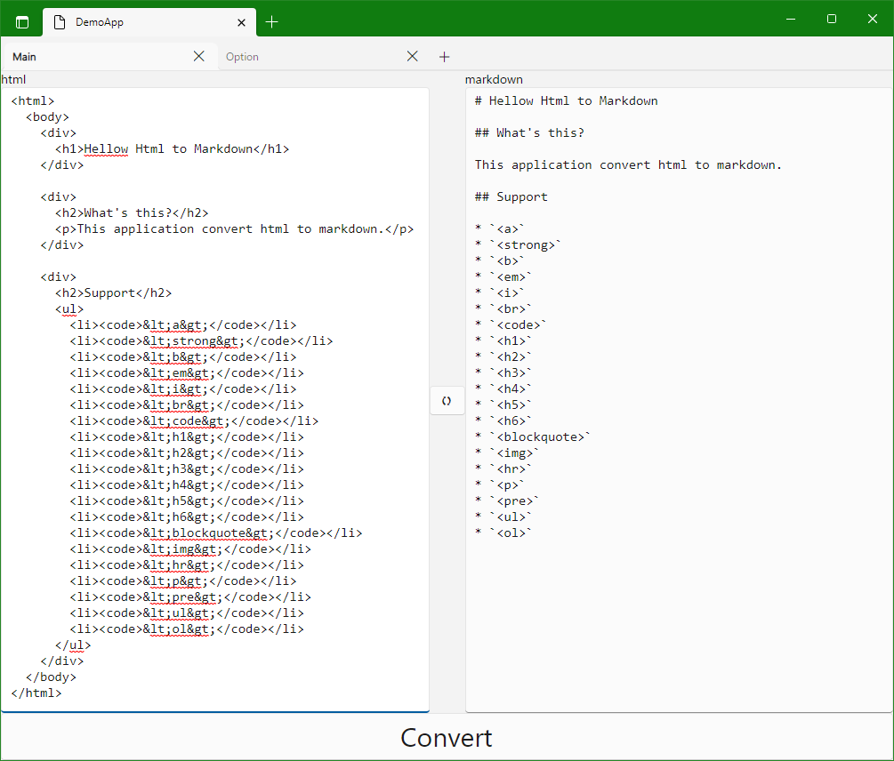

# MarkdownFromHtml

Converts HTML to [Markdown](http://daringfireball.net/projects/markdown/syntax).


## Support

This project will currently convert the following HTML tags:-

- `<a>`
- `<strong>`
- `<b>`
- `<em>`
- `<i>`
- `<br>`
- `<code>`
- `<h1>`
- `<h2>`
- `<h3>`
- `<h4>`
- `<h5>`
- `<h6>`
- `<blockquote>`
- ``
- `<hr>`
- `<p>`
- `<pre>`
- `<ul>`
- `<ol>`

And extensions add

- `<cite>`
- `<del>`
- `<figure>`
- `<footer>`
- `<ins>`
- `<mark>`
- `<sub>`
- `<sup>`
- `<table>`


## Usage

### Strings

```csharp
var html = "Something to <strong>convert</strong>";
var converter = new Converter();
var markdown = converter.Convert(html);
```

### Files

```csharp
var path = "file.html";
var converter = new Converter();
var markdown = converter.ConvertFile(path);
```

## Customise

`ReplaceManager` used to build the converter accepts other parsers.
It can enable extension syntax; table, del(strikethrough), etc.

```cs
// using MarkdownFromHtml.Parsers;
// using MarkdownFromHtml.Parsers.MarkdigExtensions;

var manager = new ReplaceManager();
manager.Register(new GridTableParser());
manager.Register(new PipeTableParser());

ver converter = new Converter(manager);
```

## Try it

If you can run WebAssembly, please see [demoapps](https://whistyun.github.io/MarkdownFromHtml/demo/index.html).



## License

This project is licensed under [Apache License 2.0](http://www.apache.org/licenses/LICENSE-2.0).